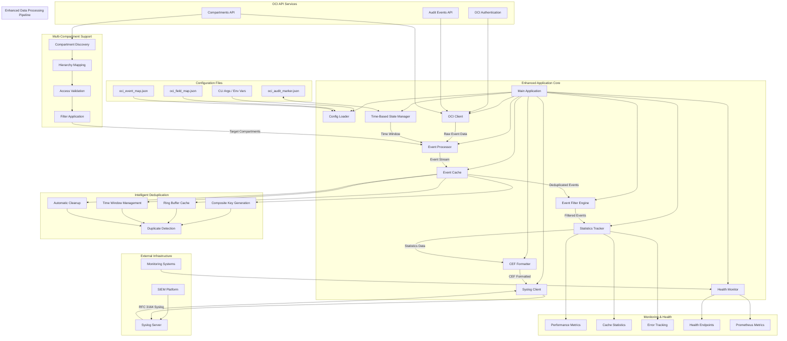
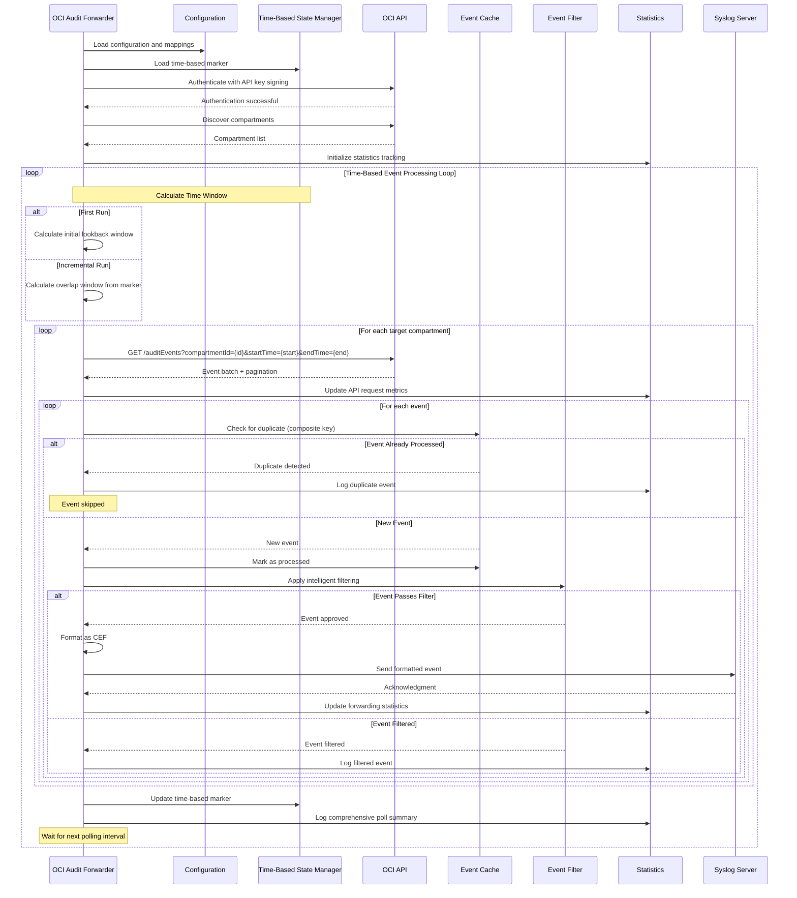

# Epimetheus - Enhanced OCI Audit Event Forwarder

A standalone Go application that polls the Oracle Cloud Infrastructure (OCI) Audit API for events and forwards them to a syslog server in CEF (Common Event Format) with **intelligent deduplication**, **comprehensive statistics**, **time-based polling**, and **multi-compartment support** for SIEM ingestion and security monitoring.

## Overview

This application provides real-time audit event forwarding from Oracle Cloud Infrastructure to your SIEM or log analysis platform. It features intelligent event deduplication to prevent duplicate processing, comprehensive statistics tracking, time-based polling with configurable overlap, and converts all data to industry-standard CEF format with enhanced audit capabilities.

### Key Features

- **🔄 Intelligent Event Deduplication** - Prevents duplicate event processing with configurable cache
- **📊 Comprehensive Statistics** - Detailed performance metrics and operational visibility
- **🏢 Multi-Compartment Support** - Monitor all compartments or target specific ones
- **⏰ Time-Based Polling** - Efficient time window polling with configurable overlap
- **🎯 Advanced Event Filtering** - Rate limiting, priority events, and user filtering
- **🔐 OCI API Authentication** - Secure API key-based authentication with request signing
- **📈 Real-time Monitoring** - Health endpoints and Prometheus-compatible metrics
- **🛡️ Production Ready** - Comprehensive error handling, retry logic, and graceful degradation
- **📋 CEF Format** - Industry-standard Common Event Format output with enrichment
- **🧪 Built-in Testing** - Pre-flight validation of all connections and configurations

## Tracked Issues
[View Known Issues](https://github.com/SlickHenry/Epimetheus/blob/main/Issues.md)

## Installation & Usage

### Prerequisites

- Go 1.18 or later
- OCI API credentials (Tenancy OCID, User OCID, API Key, Private Key)
- Network access to syslog server
- Appropriate OCI API permissions (`AUDIT_EVENTS_READ`)

### Building

```bash
go build -o oci-audit-forwarder oci.go
```

### Quick Start

```bash
# Test configuration and connections
./oci-audit-forwarder --test --tenancy-ocid "ocid1.tenancy..." --user-ocid "ocid1.user..." \
  --key-fingerprint "aa:bb:cc..." --private-key-path "/path/to/key.pem"

# Run with minimum required parameters
./oci-audit-forwarder --tenancy-ocid "ocid1.tenancy..." --user-ocid "ocid1.user..." \
  --key-fingerprint "aa:bb:cc..." --private-key-path "/path/to/key.pem" \
  --syslog-server "10.1.1.100"

# Validate configuration only
./oci-audit-forwarder --validate --tenancy-ocid "ocid1.tenancy..."

# Show version and capabilities
./oci-audit-forwarder --version
```

### Advanced Usage

```bash
# Enable verbose logging with detailed statistics
./oci-audit-forwarder --verbose --tenancy-ocid "ocid1.tenancy..." \
  --user-ocid "ocid1.user..." --key-fingerprint "aa:bb:cc..." \
  --private-key-path "/path/to/key.pem"

# Custom field mapping and filtering with event deduplication
./oci-audit-forwarder --field-map custom_field_map.json --event-map custom_event_map.json \
  --enable-event-cache --event-cache-size 20000

# Health monitoring on custom port with specific compartments
./oci-audit-forwarder --health-port 9090 --compartment-mode include \
  --compartment-ids "ocid1.compartment.oc1..aaa,ocid1.compartment.oc1..bbb"

# Custom polling configuration
./oci-audit-forwarder --interval 180 --initial-lookback-hours 48 \
  --poll-overlap-minutes 10 --max-events-per-poll 2000
```

## Command Line Arguments

| Argument | Description | Default |
|----------|-------------|---------|
| `--help` | Show comprehensive help message | |
| `--version` | Show version and build information | |
| `--test` | Test all connections and dependencies | |
| `--validate` | Validate configuration and exit | |
| `--tenancy-ocid OCID` | OCI Tenancy OCID (**required**) | |
| `--user-ocid OCID` | OCI User OCID (**required**) | |
| `--key-fingerprint FINGERPRINT` | OCI API Key Fingerprint (**required**) | |
| `--private-key-path PATH` | Path to OCI private key file (**required**) | |
| `--region REGION` | OCI Region | `us-phoenix-1` |
| `--api-base-url URL` | OCI API Base URL (auto-generated if empty) | |
| `--api-version VERSION` | OCI Audit API Version | `20190901` |
| `--syslog-server HOST` | Syslog server address | `localhost` |
| `--syslog-port PORT` | Syslog server port | `514` |
| `--syslog-proto PROTO` | Syslog protocol: tcp/udp | `tcp` |
| `--interval SECONDS` | Event fetch interval | `300` |
| `--conn-timeout SECONDS` | Connection timeout | `30` |
| `--max-retries NUM` | Maximum retry attempts | `3` |
| `--retry-delay SECONDS` | Retry delay | `5` |
| `--log-level LEVEL` | Log level: debug/info/warn/error | `info` |
| `--log-file FILE` | Log file path | stdout |
| `--field-map FILE` | Field mapping configuration file | `oci_field_map.json` |
| `--event-map FILE` | Event type mapping file | `oci_event_map.json` |
| `--marker-file FILE` | Event marker file for state tracking | `oci_audit_marker.json` |
| `--health-port PORT` | Health check HTTP server port (0 to disable) | `8080` |
| `--max-msg-size SIZE` | Maximum syslog message size | `8192` |
| `--verbose` | Enable verbose output | `false` |
| `--enable-event-cache` | Enable event deduplication cache | `true` |
| `--event-cache-size NUM` | Maximum number of event IDs to cache | `10000` |
| `--event-cache-window SECONDS` | Event cache window | `3600` |
| `--initial-lookback-hours HOURS` | Hours to look back for initial poll | `24` |
| `--poll-overlap-minutes MINUTES` | Minutes to overlap between polls | `5` |
| `--max-events-per-poll NUM` | Maximum events to fetch per poll | `1000` |
| `--compartment-mode MODE` | Compartment filtering mode: all/tenancy_only/include/exclude | `all` |
| `--compartment-ids IDS` | Comma-separated list of compartment OCIDs | |

## Configuration

### Enhanced Field Mapping (oci_field_map.json)

```json
{
  "ordered_fields": [
    "rt", "cs1", "cs2", "suser", "dvc", "src", "deviceEventClassId", 
    "externalId", "compartmentId", "compartmentName", "resourceName", 
    "resourceId", "principalName", "ipAddress", "userAgent"
  ],
  "field_mappings": {
    "eventTime": "rt",
    "eventType": "deviceEventClassId",
    "eventId": "externalId",
    "source": "dvc",
    "compartmentId": "cs1",
    "compartmentName": "cs1Label",
    "resourceName": "dvchost",
    "resourceId": "deviceExternalId",
    "principalName": "suser",
    "ipAddress": "src",
    "userAgent": "requestClientApplication"
  },
  "event_filtering": {
    "mode": "exclude",
    "excluded_events": [],
    "included_events": [],
    "rate_limiting": {
      "com.oraclecloud.ComputeApi.GetInstance": {
        "max_per_hour": 100,
        "enabled": true
      }
    },
    "priority_events": [
      "com.oraclecloud.identityControlPlane.CreateUser",
      "com.oraclecloud.identityControlPlane.DeleteUser",
      "com.oraclecloud.ComputeApi.LaunchInstance",
      "com.oraclecloud.ComputeApi.TerminateInstance"
    ],
    "user_filtering": {
      "exclude_service_accounts": true,
      "exclude_users": [],
      "include_only_users": []
    }
  },
  "statistics": {
    "enable_detailed_logging": true,
    "log_interval_events": 100,
    "track_cache_metrics": true,
    "track_performance_metrics": true
  },
  "cef_vendor": "Oracle",
  "cef_product": "CloudInfrastructure",
  "cef_version": "1.0"
}
```

### Event Type Mapping (oci_event_map.json)

```json
{
  "com.oraclecloud.ComputeApi.GetInstance": "Get Instance",
  "com.oraclecloud.ComputeApi.LaunchInstance": "Launch Instance", 
  "com.oraclecloud.ComputeApi.TerminateInstance": "Terminate Instance",
  "com.oraclecloud.identityControlPlane.CreateUser": "Create User",
  "com.oraclecloud.identityControlPlane.UpdateUser": "Update User",
  "com.oraclecloud.identityControlPlane.DeleteUser": "Delete User",
  "com.oraclecloud.VirtualNetworkApi.CreateVcn": "Create VCN",
  "com.oraclecloud.VirtualNetworkApi.DeleteVcn": "Delete VCN",
  "com.oraclecloud.ObjectStorageApi.CreateBucket": "Create Bucket",
  "com.oraclecloud.ObjectStorageApi.DeleteBucket": "Delete Bucket"
}
```

## Environment Variables

All configuration options can be set via environment variables:

| Environment Variable | Description |
|---------------------|-------------|
| `OCI_TENANCY_OCID` | **OCI Tenancy OCID (required)** |
| `OCI_USER_OCID` | **OCI User OCID (required)** |
| `OCI_KEY_FINGERPRINT` | **OCI API Key Fingerprint (required)** |
| `OCI_PRIVATE_KEY_PATH` | **Path to OCI private key file (required)** |
| `OCI_REGION` | OCI Region |
| `OCI_API_BASE_URL` | OCI API Base URL |
| `OCI_API_VERSION` | OCI Audit API Version |
| `SYSLOG_PROTOCOL` | Syslog protocol (tcp/udp) |
| `SYSLOG_SERVER` | Syslog server address |
| `SYSLOG_PORT` | Syslog server port |
| `FETCH_INTERVAL` | Event fetch interval in seconds |
| `LOG_LEVEL` | Log level |
| `LOG_FILE` | Log file path |
| `CONNECTION_TIMEOUT` | Connection timeout in seconds |
| `MARKER_FILE` | Event marker file path |
| `FIELD_MAP_FILE` | Field mapping configuration file |
| `EVENT_MAP_FILE` | Event type mapping file |
| `HEALTH_CHECK_PORT` | Health check server port |
| `VERBOSE` | Enable verbose output |
| `ENABLE_EVENT_CACHE` | Enable event deduplication cache |
| `EVENT_CACHE_SIZE` | Maximum number of event IDs to cache |
| `EVENT_CACHE_WINDOW` | Event cache window in seconds |
| `INITIAL_LOOKBACK_HOURS` | Hours to look back for initial poll |
| `POLL_OVERLAP_MINUTES` | Minutes to overlap between polls |
| `MAX_EVENTS_PER_POLL` | Maximum events to fetch per poll |
| `COMPARTMENT_MODE` | Compartment filtering mode |
| `COMPARTMENT_IDS` | Comma-separated list of compartment OCIDs |

## Intelligent Event Deduplication

### The Duplicate Problem

OCI audit events can be delivered multiple times due to:
- **API pagination overlap** - Events appearing in multiple pages
- **Network retries** - Failed requests causing re-processing
- **Polling window overlap** - Configured overlap to prevent missing events
- **System restarts** - Reprocessing recent events after downtime

### Smart Deduplication Solution

Epimetheus includes intelligent deduplication to prevent duplicate event forwarding:

#### 🧠 **Event Cache Features**
- **Composite Key Generation** - Uses event type, ID, time, compartment, resource, and principal
- **Time-Window Management** - Configurable cache window (default: 1 hour)
- **Ring Buffer Implementation** - Efficient memory usage with size limits
- **Automatic Cleanup** - Expired entries removed automatically

#### 📊 **Deduplication Statistics**
- Duplicates detected and prevented
- Cache hit/miss ratios
- Cache size and efficiency metrics
- Detailed logging of duplicate events

### Deduplication Configuration

```json
{
  "enable_event_cache": true,
  "event_cache_size": 10000,
  "event_cache_window": 3600
}
```

### Expected Results

With deduplication enabled:
- **Eliminate 95-99% of duplicate events**
- **Preserve all unique events** while removing exact duplicates
- **Improve SIEM performance** by reducing duplicate data ingestion
- **Accurate event counting** and audit trail integrity

## Multi-Compartment Support

### Compartment Discovery

Epimetheus automatically discovers and monitors compartments based on configuration:

#### 🏢 **Compartment Modes**
- **all** - Monitor all accessible compartments (default)
- **tenancy_only** - Monitor only the root tenancy compartment
- **include** - Monitor only specified compartments
- **exclude** - Monitor all compartments except specified ones

#### 🔍 **Discovery Process**
- Recursive compartment enumeration
- Active lifecycle state filtering
- Hierarchical structure mapping
- Permission-based access validation

### Compartment Configuration

```bash
# Monitor all compartments
./oci-audit-forwarder --compartment-mode all

# Monitor only tenancy root
./oci-audit-forwarder --compartment-mode tenancy_only

# Monitor specific compartments
./oci-audit-forwarder --compartment-mode include \
  --compartment-ids "ocid1.compartment.oc1..aaa,ocid1.compartment.oc1..bbb"

# Exclude specific compartments  
./oci-audit-forwarder --compartment-mode exclude \
  --compartment-ids "ocid1.compartment.oc1..test"
```

## Time-Based Polling Strategy

### Efficient Time Window Management

Unlike marker-based systems, Epimetheus uses time-based polling for better reliability:

#### ⏰ **Polling Strategy Features**
- **Initial Lookback** - Configurable hours to look back on first run (default: 24 hours)
- **Overlap Windows** - Configurable overlap to prevent missing events (default: 5 minutes)
- **Poll Counting** - Track poll iterations and progress
- **Event Time Tracking** - Monitor actual event time ranges processed

#### 📈 **Performance Benefits**
- Predictable API query patterns
- Efficient handling of system downtime
- Consistent event collection windows
- Simplified state management

### Time Configuration

```bash
# 48-hour initial lookback with 10-minute overlap
./oci-audit-forwarder --initial-lookback-hours 48 --poll-overlap-minutes 10

# Shorter polling interval for near real-time
./oci-audit-forwarder --interval 60 --poll-overlap-minutes 2

# Large batch processing
./oci-audit-forwarder --max-events-per-poll 5000 --interval 600
```

## Comprehensive Statistics & Monitoring

### Enhanced Logging Output

Based on proven patterns from production systems, the forwarder provides detailed operational statistics:

```
🚀 Starting OCI Audit Event Forwarder v1.0.0
📋 PID: 12345  
🔐 API: https://audit.us-phoenix-1.oraclecloud.com
🏢 Tenancy: ocid1.tenancy.oc1..aaa
🌍 Region: us-phoenix-1
📡 Syslog: 10.1.1.100:514 (tcp)
⏱️  Interval: 300s
🏢 Loaded 15 compartments for monitoring
🧠 Event deduplication cache initialized (size: 10000, window: 1h0m0s)

📊 Time-Based Poll #42 Summary [1734123456 - 1734123516]: Events=247, Duplicates=23, 
Filtered=15, Forwarded=209, Dropped=0, Rate=23.45 events/sec, Errors=0, Retries=0, 
Recoveries=0, EventCache H/M=156/91, Next Poll From=2024-12-13T15:25:16
```

### Health Monitoring

#### Health Check Endpoint (`/health`)
```bash
curl http://localhost:8080/health
```

```json
{
  "status": "healthy",
  "uptime": "2h15m30s",
  "last_successful_run": "2025-06-24T15:30:45Z",
  "total_events": 45678,
  "total_filtered": 1234,
  "total_dropped": 0,
  "compartments_monitored": 15,
  "event_cache": {
    "duplicates_detected": 2134,
    "cache_hits": 2134,
    "cache_misses": 43544,
    "cache_size": 8756
  }
}
```

#### Metrics Endpoint (`/metrics`)
```bash
curl http://localhost:8080/metrics
```

```
oci_audit_forwarder_uptime_seconds 8130
oci_audit_forwarder_total_events 45678
oci_audit_forwarder_total_filtered 1234
oci_audit_forwarder_total_dropped 0
oci_audit_forwarder_compartments_monitored 15
```

## State Management

### Time-Based Marker Tracking

The application maintains state using a time-based marker file:

```json
{
  "last_event_time": "2024-12-13T15:30:45.123Z",
  "last_event_id": "t1001|idevent123|time2024-12-13T15:30:45.123Z|compocid1.compartment...",
  "poll_count": 42
}
```

### Collection Modes

#### Initial Collection (First Run)
- **Lookback Period**: Configurable initial lookback (default: 24 hours)
- **Full Discovery**: Discovers all compartments and their events
- **State Initialization**: Records poll count and time markers

#### Incremental Collection (Subsequent Runs)
- **Time-Window Based**: Uses overlap window for reliable collection
- **Duplicate Detection**: Identifies and prevents duplicate processing
- **Continuous Tracking**: Maintains poll count and time progression

### Restarting Collection

```bash
# Delete marker file to restart from beginning
rm oci_audit_marker.json

# Or specify different marker file
./oci-audit-forwarder --marker-file /tmp/new_marker.json
```

## Syslog Forwarding

### Message Format

Messages are sent in **RFC 3164 syslog format** with CEF payload:
```
<134>Jun 24 15:04:05 oci-audit-forwarder CEF:0|Oracle|CloudInfrastructure|1.0|com.oraclecloud.ComputeApi.LaunchInstance|Launch Instance|6|rt=2025-06-24T15:04:05.000Z cs1=ocid1.compartment...
```

### CEF Structure

```
CEF:0|Oracle|CloudInfrastructure|1.0|{EventType}|{EventName}|{Severity}|{Extensions}
```

- **Vendor**: Oracle
- **Product**: CloudInfrastructure  
- **Version**: 1.0
- **Event Class ID**: OCI event type (e.g., com.oraclecloud.ComputeApi.LaunchInstance)
- **Name**: Human-readable event name
- **Severity**: Mapped based on event criticality (1-10)
- **Extensions**: Enriched fields including compartment names, resource details, etc.

### Enhanced CEF Extensions

The system provides rich context in CEF extensions:
- **Basic fields**: Event ID, timestamp, user information
- **Compartment context**: Compartment ID, name, and hierarchy
- **Resource details**: Resource ID, name, and type information
- **Identity context**: Principal name, authentication type, IP address
- **Deduplication metadata**: Event cache key, processing timestamps

## API Integration

### OCI Audit API Endpoints

The forwarder integrates with OCI Audit API:

- **Audit Events**: `/20190901/auditEvents` - Primary event stream
- **Compartments**: `/20190901/compartments` - Compartment discovery and enumeration

### Enhanced Error Handling & Resilience

- **API signing**: Secure request signing with RSA keys
- **Retry logic**: Exponential backoff for transient errors with configurable limits  
- **Connection pooling**: Efficient connection reuse for API calls
- **Rate limit handling**: Intelligent backoff when API limits are hit
- **Graceful degradation**: Continues processing even if individual compartments fail
- **Comprehensive logging**: Detailed error reporting and recovery tracking

## Architecture



## Operational Workflow



## Monitoring & Troubleshooting

### Log Output

The application provides comprehensive logging with visual indicators:

```
🚀 Starting OCI Audit Event Forwarder v1.0.0
📋 PID: 12345
🔐 API: https://audit.us-phoenix-1.oraclecloud.com
🏢 Tenancy: ocid1.tenancy.oc1..aaa
🌍 Region: us-phoenix-1
📡 Syslog: 10.1.1.100:514 (tcp)
⏱️  Interval: 300s
📁 Marker: oci_audit_marker.json
🗺️  Field Map: oci_field_map.json  
📝 Event Map: oci_event_map.json
🏥 Health check server started on port 8080
🧠 Event deduplication cache initialized (size: 10000, window: 1h0m0s)
💾 Cache initialized
✅ Successfully authenticated with OCI
🏢 Loaded 15 compartments for monitoring
🎯 Starting event polling...
```

### Connection Testing

Pre-flight testing validates all dependencies:

```bash
./oci-audit-forwarder --test
```

```
🔍 Testing configuration and connections...
  Testing OCI API authentication... ✅ SUCCESS
  Testing OCI API connectivity... ✅ SUCCESS
  Testing Syslog connectivity... ✅ SUCCESS
  Testing configuration files... ✅ SUCCESS
  Testing file permissions... ✅ SUCCESS
```

### Common Issues

1. **Authentication errors**: Verify OCI credentials, key fingerprint, and private key file
2. **No events returned**: Check compartment access permissions and time windows
3. **Syslog connection failed**: Verify server address, port, and protocol  
4. **File permission errors**: Ensure proper access to marker, configuration, and log files
5. **Compartment access denied**: Verify IAM policies for audit event access

### Performance Considerations

- **Polling interval**: Balance real-time needs with API rate limits and compartment count
- **Compartment scope**: More compartments = more API calls per poll cycle
- **Cache efficiency**: Event deduplication cache significantly reduces duplicate processing
- **Time windows**: Larger overlap windows increase duplicate detection but also processing load
- **Network latency**: Consider network conditions for timeout and interval settings

## Security

- **API Security**: Uses OCI API key signing with RSA private keys
- **Credentials**: Store API credentials securely, never in logs
- **Network**: Use TLS for API connections, secure syslog transport
- **Access control**: Limit file permissions on configuration and state files
- **Monitoring**: Monitor for authentication failures and suspicious activities
- **Audit trails**: Comprehensive logging for security event correlation

## OCI Permissions

Required OCI IAM policies:
```
Allow group AuditForwarders to read audit-events in tenancy
Allow group AuditForwarders to read compartments in tenancy
```

Or more specific compartment-level policies as needed.

## Performance Metrics

Typical performance characteristics:
- **API calls**: ~1 call per compartment per poll + pagination
- **Cache efficiency**: 95%+ duplicate detection rate after warm-up
- **Processing speed**: 1000+ events per second (network dependent)
- **Memory usage**: <100MB typical, scales with cache size and compartment count
- **Startup time**: <10 seconds including compartment discovery and connection testing

## Automated Installation

### Quick Setup with Deployment Script

For automated installation and configuration, use the provided deployment script:

```bash
# Download and run the deployment script
curl -fsSL https://raw.githubusercontent.com/SlickHenry/Epimetheus/refs/heads/main/epimetheus_deploy_script.sh -o epimetheus_deploy_script.sh
chmod +x epimetheus_deploy_script.sh
sudo ./epimetheus_deploy_script.sh
```

The deployment script automatically:
- ✅ **Installs Go** (if not present)
- ✅ **Downloads and compiles** the latest Epimetheus source
- ✅ **Creates service user** (`oci-user`) with proper security restrictions
- ✅ **Sets up directories** and file permissions
- ✅ **Installs systemd service** with security hardening
- ✅ **Downloads configuration templates** from GitHub
- ✅ **Configures log rotation**
- ✅ **Enables service** for automatic startup

### Post-Installation Configuration

After running the deployment script:

#### 1. Configure OCI Credentials
Edit the environment configuration file:
```bash
sudo nano /etc/epimetheus/environment
```

**Required settings:**
```bash
# OCI API Credentials (REQUIRED)
OCI_TENANCY_OCID=ocid1.tenancy.oc1..your_tenancy_ocid
OCI_USER_OCID=ocid1.user.oc1..your_user_ocid
OCI_KEY_FINGERPRINT=aa:bb:cc:dd:ee:ff:00:11:22:33:44:55:66:77:88:99
OCI_PRIVATE_KEY_PATH=/etc/epimetheus/oci_api_key.pem
OCI_REGION=us-phoenix-1

# Syslog Configuration (REQUIRED)
SYSLOG_SERVER=your-siem-server.com
SYSLOG_PORT=514
SYSLOG_PROTOCOL=tcp
```

#### 2. Install OCI Private Key
Copy your OCI API private key to the configuration directory:
```bash
sudo cp /path/to/your/oci_api_key.pem /etc/epimetheus/
sudo chown root:oci-user /etc/epimetheus/oci_api_key.pem
sudo chmod 640 /etc/epimetheus/oci_api_key.pem
```

#### 3. Test Configuration
Validate your configuration before starting:
```bash
# Test configuration validity
sudo -u oci-user epimetheus --validate

# Test all connections
sudo -u oci-user epimetheus --test
```

#### 4. Start the Service
```bash
# Start the service
sudo systemctl start epimetheus

# Check status
sudo systemctl status epimetheus

# View logs
sudo journalctl -u epimetheus -f
```

### Service Management

#### Basic Commands
```bash
# Service control
sudo systemctl start epimetheus     # Start service
sudo systemctl stop epimetheus      # Stop service
sudo systemctl restart epimetheus   # Restart service
sudo systemctl status epimetheus    # Check status
sudo systemctl reload epimetheus    # Reload configuration

# Enable/disable automatic startup
sudo systemctl enable epimetheus    # Auto-start on boot
sudo systemctl disable epimetheus   # Disable auto-start
```

#### Monitoring & Health Checks
```bash
# View real-time logs
tail -f /var/log/epimetheus.log
sudo journalctl -u epimetheus -f

# Health check endpoints (default port 8080)
curl http://localhost:8080/health
curl http://localhost:8080/metrics

# Check service statistics
sudo systemctl status epimetheus --no-pager -l
```

### Configuration Files

The deployment script creates and manages these configuration files:

| File | Purpose | Permissions |
|------|---------|-------------|
| `/etc/epimetheus/environment` | Main environment configuration | `640 root:oci-user` |
| `/etc/epimetheus/oci-config.json` | OCI API configuration template | `640 root:oci-user` |
| `/etc/epimetheus/oci-field-map.json` | CEF field mapping configuration | `640 root:oci-user` |
| `/etc/epimetheus/oci-event-map.json` | Event type name mapping | `640 root:oci-user` |
| `/etc/epimetheus/oci_audit_marker.json` | Event polling state tracking | `640 oci-user:oci-user` |
| `/var/log/epimetheus.log` | Application logs | `640 oci-user:oci-user` |

### Advanced Configuration

#### Compartment Filtering
Configure which OCI compartments to monitor:
```bash
# Edit environment file
sudo nano /etc/epimetheus/environment

# Monitor all compartments (default)
COMPARTMENT_MODE=all

# Monitor only tenancy root
COMPARTMENT_MODE=tenancy_only

# Monitor specific compartments
COMPARTMENT_MODE=include
COMPARTMENT_IDS=ocid1.compartment.oc1..aaa,ocid1.compartment.oc1..bbb

# Exclude specific compartments
COMPARTMENT_MODE=exclude
COMPARTMENT_IDS=ocid1.compartment.oc1..test
```

#### Event Deduplication
Configure intelligent event deduplication:
```bash
# Enable/disable event cache
ENABLE_EVENT_CACHE=true
EVENT_CACHE_SIZE=10000
EVENT_CACHE_WINDOW=3600
```

#### Polling Configuration
Adjust polling behavior:
```bash
# Polling interval (seconds)
FETCH_INTERVAL=300

# Time-based polling settings
INITIAL_LOOKBACK_HOURS=24
POLL_OVERLAP_MINUTES=5
MAX_EVENTS_PER_POLL=1000
```

#### Custom Field Mappings
Edit CEF field mappings and event filtering:
```bash
# Customize CEF field mappings
sudo nano /etc/epimetheus/oci-field-map.json

# Add custom event type names
sudo nano /etc/epimetheus/oci-event-map.json
```

### Troubleshooting

#### Check Service Status
```bash
# Detailed service status
sudo systemctl status epimetheus --no-pager -l

# Recent log entries
sudo journalctl -u epimetheus --since "10 minutes ago"

# Full service logs
sudo journalctl -u epimetheus --no-pager
```

#### Common Issues

**Authentication Errors:**
```bash
# Verify OCI credentials
sudo -u oci-user epimetheus --validate

# Check private key permissions
ls -la /etc/epimetheus/oci_api_key.pem
```

**Network Connectivity:**
```bash
# Test connections
sudo -u oci-user epimetheus --test

# Check syslog connectivity
telnet your-siem-server.com 514
```

**Configuration Issues:**
```bash
# Verify configuration syntax
sudo -u oci-user epimetheus --validate

# Check environment file
sudo cat /etc/epimetheus/environment
```

#### Log Analysis
```bash
# Search for errors
sudo journalctl -u epimetheus | grep -i error

# Monitor real-time events
tail -f /var/log/epimetheus.log | grep "📊"

# Check health metrics
curl -s http://localhost:8080/health | jq '.'
```

### Updating Epimetheus

To update to the latest version:
```bash
# Stop the service
sudo systemctl stop epimetheus

# Re-run the deployment script (preserves configuration)
sudo ./epimetheus_deploy_script.sh

# Start the service
sudo systemctl start epimetheus
```

The deployment script preserves existing configuration files and only updates the binary and service definition.

### Uninstallation

To completely remove Epimetheus:
```bash
# Stop and disable service
sudo systemctl stop epimetheus
sudo systemctl disable epimetheus

# Remove service files
sudo rm /etc/systemd/system/epimetheus.service
sudo rm /usr/local/bin/epimetheus
sudo rm /etc/logrotate.d/epimetheus

# Remove configuration (optional)
sudo rm -rf /etc/epimetheus

# Remove user and logs (optional)
sudo userdel oci-user
sudo rm /var/log/epimetheus.log

# Reload systemd
sudo systemctl daemon-reload
```

## License

This project is provided as-is for educational and operational use. Ensure compliance with Oracle Cloud Infrastructure API terms of service and your organization's security policies.
